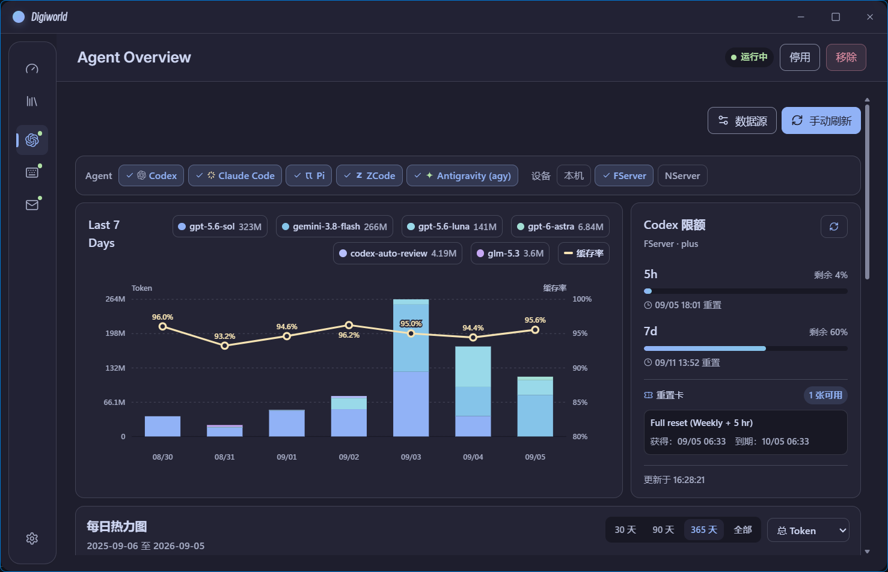
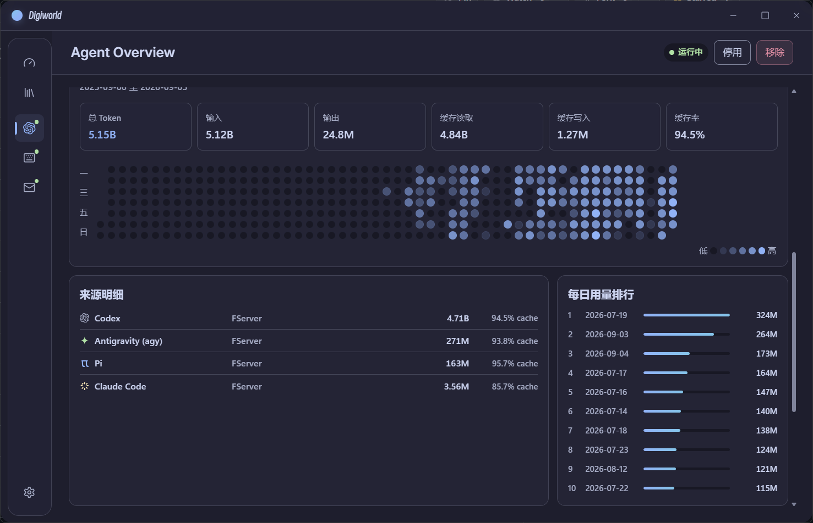
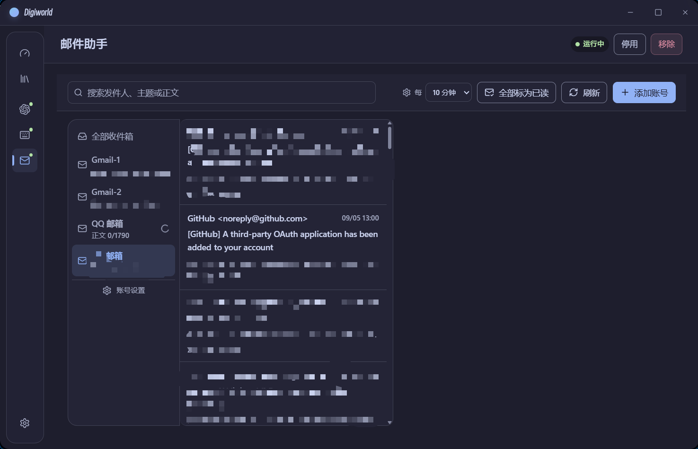

# Digiworld

> A lightweight, local-first desktop shell for installing official, signed feature plugins on demand.

[](https://github.com/JesmonX/digiworld/releases)
[](https://tauri.app)
[](https://www.rust-lang.org)
[](LICENSE)
[](docs/privacy.md)

[English](README_en.md) | [简体中文](README.md)

---

Digiworld is a lightweight, local-first desktop shell built with Tauri 2, Rust, React 19, and Vite. It is designed to run isolated, digitally-signed plugins on demand with zero user telemetry, transparent permissions, and an integrated modern design system.

## Key Highlights

- **Local-first & Privacy-first**: No telemetry, no crash reporting, and zero third-party analytics. Sensitive credentials stay in the OS credential store (Keyring), and usage metrics are computed locally.
- **Sandboxed Plugin Architecture**: Plugin UIs run inside sandboxed iframes communicating via a secure `postMessage` bridge. Plugin backends run as isolated subprocesses over anonymous pipes with newline-delimited JSON-RPC 2.0 (enforcing a 4 MiB payload cap and 15s timeout).
- **Unified Design System**: Host and plugins share `@digiworld/design-system` with semantic tokens (`--dw-*`), built-in Catppuccin and Rosé Pine themes, glass morphism effects, and proportional typography scaling (100%, 110%, 125%). Host-managed Inter Variable and Plex Sans SC fonts are shared across plugin frames without duplicating font assets.
- **Network & Proxy Engine**: Configure system proxy, custom proxy (HTTP, HTTPS, SOCKS5, SOCKS5H), or direct connection. Individual mail accounts can independently opt in or out of the shared proxy policy.

---

## Official Plugins Showcase

### 1. Agent Overview (`agent-token-heatmap`)
Aggregates local and remote AI coding sessions across OpenAI Codex, Claude Code, Pi, ZCode, and Antigravity (agy).

- **Multi-Agent & Multi-Device**: Scans local session stores and queries remote hosts via system OpenSSH using an ephemeral in-memory Python parser (no persistent remote agent).
- **7-Day Multi-Model Trends**: Stacked bar charts by model (gpt-5.6-sol, gemini-3.8-flash, etc.) with prompt cache-hit percentage overlay.
- **Real-Time Codex Quota**: Direct integration with the local Codex App Server to display 5-hour rolling limit, 7-day quota percentages, reset countdowns, and reset credits.
- **GitHub-style Annual Heatmap**: Customizable date ranges (30d / 90d / 365d / All) with token KPI cards, source distributions, and daily top-10 usage rankings.

<div align="center">
  
  <p><em>Agent Overview: Multi-device filtering, 7-day model stacked bar chart, and Codex real-time quota</em></p>
</div>

<div align="center">
  
  <p><em>Agent Overview: Token KPI cards, GitHub-style annual heatmap, source breakdown, and top-10 days</em></p>
</div>

---

### 2. Mail Assistant (`mail-assistant`)
A local-first, distraction-free IMAP email reader.

- **Multi-Account Aggregation**: Supports Gmail, QQ Mail, 163, and custom TLS IMAP servers.
- **Secure Credentials**: Passwords and app tokens are stored securely in the OS credential store (Keyring), never in SQLite or plain-text files.
- **Offline Full-Text Search**: Fast local SQLite index over headers and decoded plain-text bodies; attachments and external tracking scripts are not loaded.
- **One-Click Read Sync**: Background synchronization of the IMAP `\Seen` flag for selected accounts without deleting or moving messages.
- **Per-Account Proxy**: Flexible routing allowing domestic and international inboxes to use independent proxy settings.

<div align="center">
  
  <p><em>Mail Assistant: Unified multi-account inbox, instant search, and one-click mark all as read</em></p>
</div>

---

### 3. Keyboard Heatmap (`keyboard-heatmap`)
Hardware physical key heatmap for developers and mechanical keyboard enthusiasts.

- **Physical Layouts**: 104-key, 87-key (TKL), 84-key (75%), 68-key (65%), and 61-key (60%) layouts.
- **Strict Privacy**: Aggregates daily press counts by physical key code only. Never records keystroke sequence, text content, active application titles, or device IDs.
- **Dynamic Heat Tiers**: Visual gradient reflecting press density with Today vs. All-time statistics and Top-10 keys.

---

## Getting Started

### Installation
Download the latest Windows installer (`.msi` or `.exe`) from [GitHub Releases](https://github.com/JesmonX/digiworld/releases).

> [!NOTE]
> Preview releases are signed using Ed25519 for updater and plugin packages, but intentionally omit Windows Authenticode. Windows SmartScreen may show an unknown-publisher warning. Verify the published `SHA256SUMS.txt` before running the installer.

---

## Development

### Prerequisites
- Node.js `24+`
- pnpm `11+`
- Rust `1.96+`
- Platform dependencies for Tauri 2

### Commands

```sh
# Install dependencies
pnpm install

# Typecheck and run tests
pnpm typecheck
cargo test --workspace

# Start desktop app in development
pnpm dev

# Design system and UI linting
pnpm check:ui
pnpm test:ui

# Package official plugins
pnpm package:agent-tokens
pnpm package:mail
pnpm package:keyboard

# Build catalog index
pnpm catalog:build
```

---

## Documentation

- [UI Design Contract](docs/ui-design.md)
- [Plugin Format v1](docs/plugin-format.md)
- [Privacy Policy](docs/privacy.md)
- [Release Policy](docs/release.md)

---

## License

Released under the [MIT License](LICENSE).
